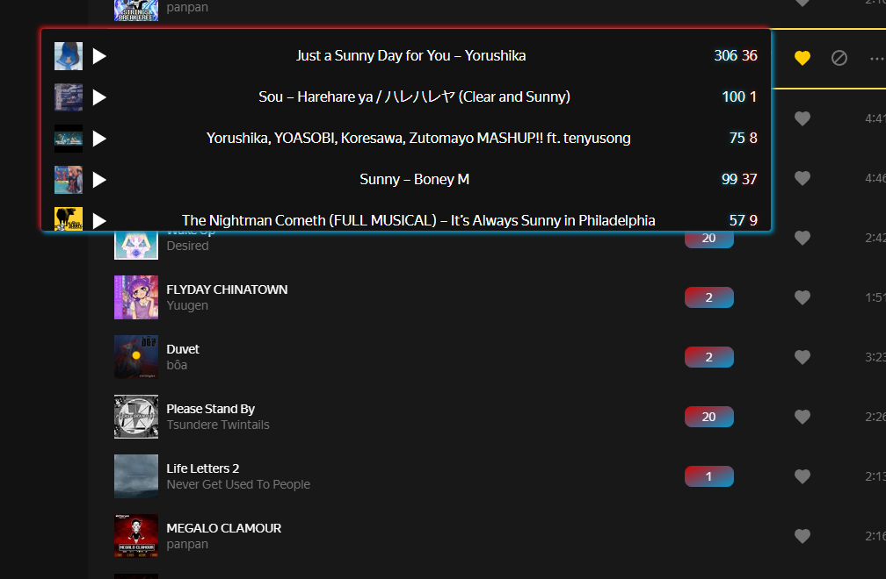

# YM<=>BS

## Расширение для Яндекс Музыки для показа доступности мелодий в Beat Saber

Расширение работает только для chromium браузеров. За инструкцией установки в гифках можете обратиться к [репозиторию моего другого расширения](https://github.com/AriesAlex/yandex-music-30min-remover)

Для работы расширение отключает некоторые CORS'ы так шо осторожнее там да не безопасно типа но мне уютненько. Мог обойтись без их отключения, парся песни в background-скрипте, но вот картинки и превью аудио парсить и сообщать content script'у как-то так себе, но может потом сделаю у меня лапки
